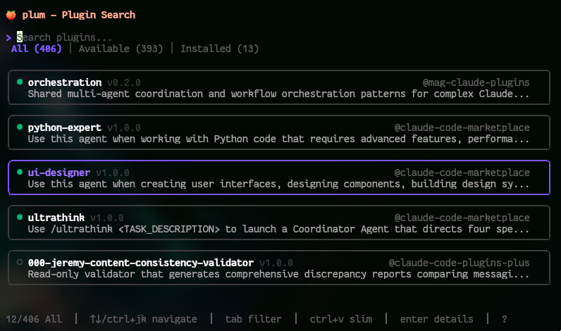
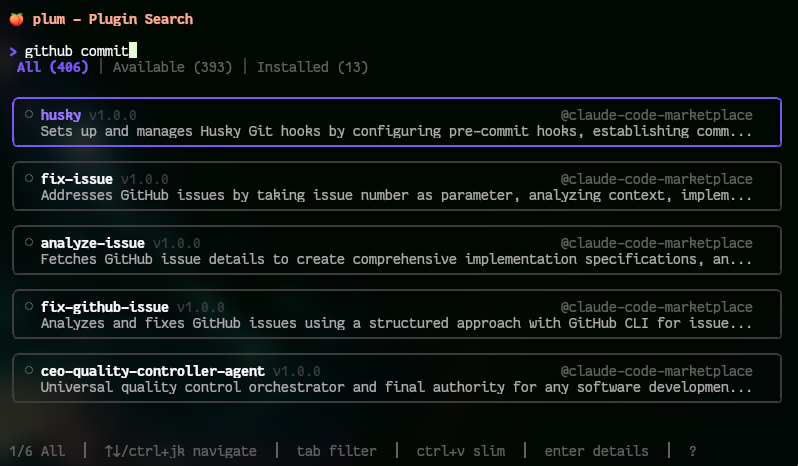
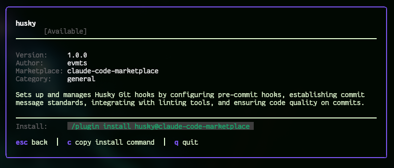
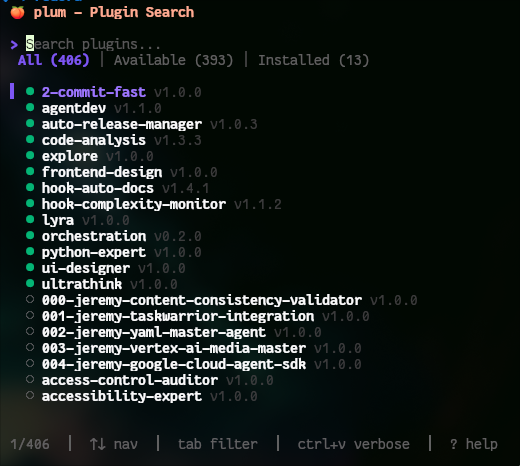
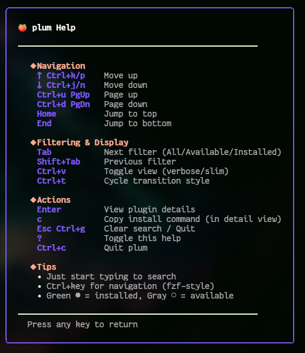

# 🍑 Plum

**A better way to discover Claude Code marketplace plugins.**

Plum is a fast, fuzzy-search TUI that helps you browse, search, and install plugins from all your configured Claude Code marketplaces in one place.



## Installation

```bash
go install github.com/itsdevcoffee/plum/cmd/plum@latest
```

Then run:

```bash
plum
```

**Requirements:** [Claude Code](https://claude.ai/claude-code) must be installed and configured with at least one marketplace.

## Key Features

- **Instant fuzzy search** across all your marketplaces
- **Filter by status**: All, Available, or Installed plugins
- **Multiple view modes**: Card (detailed) or Slim (compact)
- **One-click install commands** - press `c` to copy
- **Responsive design** that adapts to your terminal size

## Keyboard Shortcuts

| Key | Action |
|-----|--------|
| Type anything | Search plugins |
| `↑↓` or `Ctrl+j/k` | Navigate |
| `Enter` | View details |
| `Tab` | Cycle filters (All/Available/Installed) |
| `Ctrl+v` | Toggle card/slim view |
| `c` | Copy install command (in detail view) |
| `?` | Show help |
| `Esc` or `q` | Quit |

## Screenshots

### Fuzzy Search
Type to instantly filter plugins across all marketplaces:



### Plugin Details
View comprehensive information with one-click install commands:



### Multiple View Modes
Switch between card and slim views with `Ctrl+v`:

<table>
<tr>
<td width="50%">

**Card View** (Default)


</td>
<td width="50%">

**Slim View** (Compact)


</td>
</tr>
</table>

### Built-in Help
Press `?` to see all keyboard shortcuts:



## Popular Marketplaces

Plum works with any Claude Code marketplace. Here are some popular ones to get started:

| Marketplace | Description | Add It |
|------------|-------------|---------|
| [claude-code-marketplace](https://github.com/ananddtyagi/claude-code-marketplace) | Community plugins for Claude Code | Run `/plugin` in Claude Code |
| [claude-code-plugins](https://github.com/anthropics/claude-code) | Official Anthropic plugins | Included by default |
| [mag-claude-plugins](https://github.com/MadAppGang/claude-code) | MadAppGang's plugin collection | Run `/plugin` in Claude Code |
| [dev-gom-plugins](https://github.com/Dev-GOM/claude-code-marketplace) | Dev GOM's curated plugins | Run `/plugin` in Claude Code |
| [claude-code-plugins-plus](https://github.com/jeremylongshore/claude-code-plugins) | Extended plugin collection | Run `/plugin` in Claude Code |

**Have a marketplace?** Submit a PR to add it to this list! We welcome all Claude Code plugin marketplaces.

## Building from Source

```bash
git clone https://github.com/itsdevcoffee/plum.git
cd plum
go build -o plum ./cmd/plum
./plum
```

## Troubleshooting

**"Claude Code settings not found"**
- Run `claude-code` at least once to initialize your configuration

**"No plugins found"**
- Make sure you have marketplaces configured
- Run `/plugin` in Claude Code to browse and add marketplaces
- Run `/plugin marketplace update` to sync

**Custom config directory**
- Set `CLAUDE_CONFIG_DIR` environment variable if you use a non-standard location

## Contributing

Contributions are welcome! Whether it's:
- Adding your marketplace to the Popular Marketplaces list
- Reporting bugs or suggesting features
- Improving documentation
- Submitting code improvements

Feel free to open an issue or pull request.

## License

MIT - see [LICENSE](LICENSE) for details.

---

Built with [Bubble Tea](https://github.com/charmbracelet/bubbletea) • Styled with [Lip Gloss](https://github.com/charmbracelet/lipgloss)
