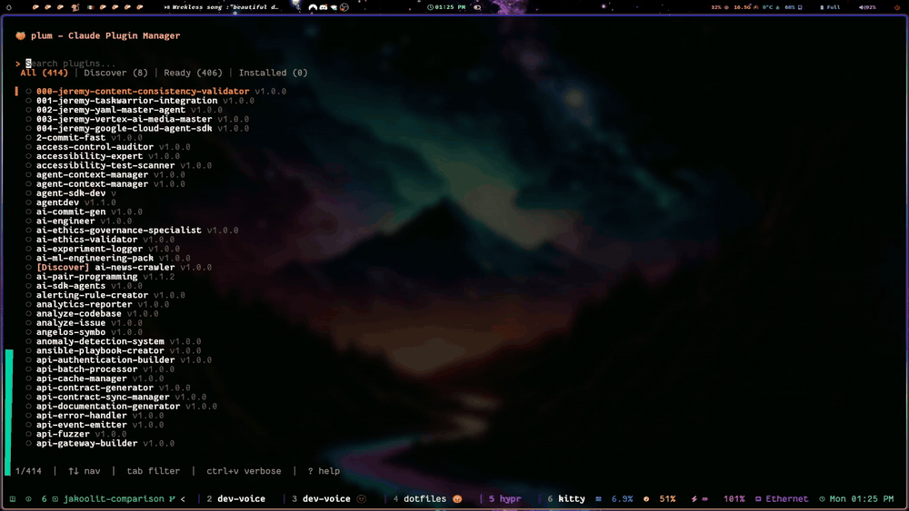
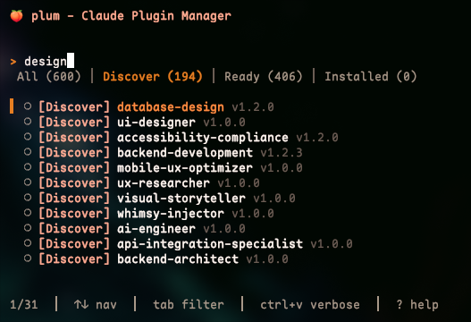
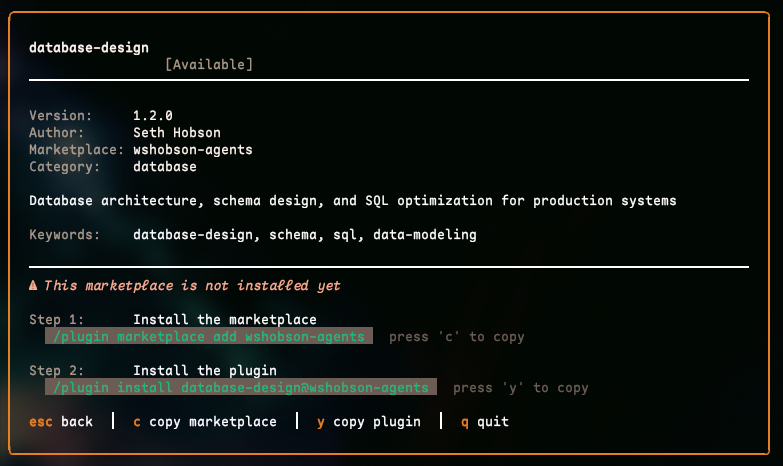
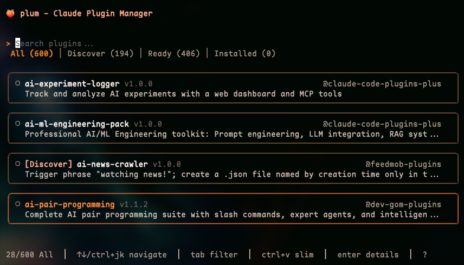
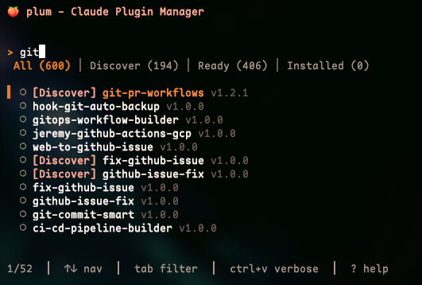
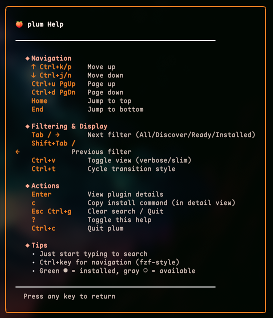

# 🍑 Plum

<!-- Google Search Console verification -->
<meta name="google-site-verification" content="DPlnw2dMGLqDS_gdLxtjUM-6giFiQIq_rnaqUExbUAo" />

[](https://go.dev/)
[](https://github.com/itsdevcoffee/plum/releases)
[](LICENSE)
[](https://goreportcard.com/report/github.com/itsdevcoffee/plum)

**A better way to discover Claude Code marketplace plugins.**

Plum is a fast, fuzzy-search TUI that lets you discover and install plugins from 11 popular marketplaces - even ones you haven't installed yet. Browse 600+ plugins instantly, no setup required.



## Popular Marketplaces

Plum works with any Claude Code marketplace. Here are some popular ones to get started:

<table>
<tr>
<th width="280">Marketplace</th>
<th>Description</th>
</tr>
<tr>
<td><a href="https://github.com/jeremylongshore/claude-code-plugins">claude-code-plugins-plus</a></td>
<td>The largest collection with <strong>254 plugins</strong> and 185 Agent Skills, focusing on production-ready automation tools across DevOps, security, testing, and AI/ML workflows.</td>
</tr>
<tr>
<td><a href="https://github.com/ananddtyagi/claude-code-marketplace">claude-code-marketplace</a></td>
<td>Community-driven marketplace featuring curated commands and agents with granular installation and auto-sync from a live database. Browse by category and install only what you need.</td>
</tr>
<tr>
<td><a href="https://github.com/anthropics/claude-code">claude-code-plugins</a></td>
<td>Official Anthropic plugins that extend Claude Code's core functionality. These plugins are maintained by the Claude Code team and ship with the tool.</td>
</tr>
<tr>
<td><a href="https://github.com/MadAppGang/claude-code">mag-claude-plugins</a></td>
<td>Battle-tested workflows from top developers with <strong>4 specialized plugins</strong> for frontend development, code analysis, Bun backend, and orchestration patterns.</td>
</tr>
<tr>
<td><a href="https://github.com/Dev-GOM/claude-code-marketplace">dev-gom-plugins</a></td>
<td>Automation-focused collection with <strong>15 plugins</strong> specializing in Unity game development, Blender 3D workflows, browser automation, and code quality monitoring.</td>
</tr>
<tr>
<td><a href="https://github.com/feed-mob/claude-code-marketplace">feedmob-claude-plugins</a></td>
<td>Productivity and workflow tools with <strong>6 specialized plugins</strong> for data processing (CSV parsing), testing, commit automation, presentation generation, and AI news aggregation.</td>
</tr>
<tr>
<td><a href="https://github.com/anthropics/skills">anthropic-agent-skills</a></td>
<td>Official Anthropic Agent Skills reference repository with document manipulation capabilities (PDF, DOCX, PPTX, XLSX) and production-quality skill implementation examples.</td>
</tr>
<tr>
<td><a href="https://github.com/wshobson/agents">wshobson-agents</a></td>
<td>Comprehensive production system with <strong>65 plugins</strong>, 91 specialized AI agents, 47 agent skills, and 15 multi-agent workflow orchestrators across 23 categories.</td>
</tr>
<tr>
<td><a href="https://github.com/docker/claude-plugins">docker-plugins</a></td>
<td>Official Docker Inc. marketplace with Docker Desktop MCP Toolkit integration for containerized MCP servers. Requires Docker Desktop 4.28+.</td>
</tr>
<tr>
<td><a href="https://github.com/ccplugins/marketplace">ccplugins-marketplace</a></td>
<td>Massive curated collection with <strong>200 plugins</strong> organized across 13 categories including DevOps, Testing, Documentation, Marketing, Security, and more.</td>
</tr>
<tr>
<td><a href="https://github.com/thedotmack/claude-mem">claude-mem</a></td>
<td>Persistent memory compression system for Claude Code with context preservation across sessions. Enables Claude to maintain project knowledge continuity through automatic tool observation capture and semantic summaries.</td>
</tr>
</table>

**Have a marketplace?** Submit a PR to add it to this list! We welcome all Claude Code plugin marketplaces.

## Installation

**macOS/Linux users (recommended):**

```bash
brew install itsdevcoffee/plum/plum
plum
```

**All platforms (requires Go 1.24+):**

```bash
go install github.com/itsdevcoffee/plum/cmd/plum@latest
plum
```

**Note:** If `plum` command isn't found after `go install`, add `$GOPATH/bin` to your PATH or run `~/go/bin/plum` directly.

## Key Features

- **Discover 600+ plugins** from 11 popular marketplaces - even ones you haven't installed yet
- **Auto-updating registry** - notifies when new marketplaces are available
- **Instant fuzzy search** across all plugins (installed + discoverable)
- **Smart filtering**: All, Discover, Ready, or Installed
- **Multiple view modes**: Card (detailed) or Slim (compact)
- **One-click install** - copy commands with `c` and `y` keys
- **Manual refresh** with `Shift+U` to fetch latest marketplaces
- **Responsive design** that adapts to your terminal size

## Keyboard Shortcuts

| Key | Action |
|-----|--------|
| Type anything | Search plugins |
| `↑↓` or `Ctrl+j/k` | Navigate |
| `Enter` | View details |
| `Tab` or `→` | Next filter (All/Discover/Ready/Installed) |
| `Shift+Tab` or `←` | Previous filter |
| `Ctrl+v` | Toggle card/slim view |
| `Shift+U` | Refresh marketplace registry and cache |
| `c` | Copy install command (marketplace for discoverable) |
| `y` | Copy plugin command (for discoverable plugins) |
| `g` | Open plugin on GitHub (in detail view) |
| `o` | Open local directory (installed plugins only) |
| `l` | Copy GitHub link to clipboard (in detail view) |
| `?` | Show help |
| `Esc` or `q` | Quit / Cancel refresh |

## Screenshots

### Discover New Marketplaces
Browse plugins from 10 popular marketplaces - even ones you haven't installed yet.
The Discover filter shows plugins from uninstalled marketplaces with [Discover] badges:



### Two-Step Installation for New Marketplaces
When you find a plugin from an uninstalled marketplace, plum shows you exactly
what to install. Press 'c' to copy the marketplace command, 'y' to copy the plugin command:

**Example:**
```bash
# Step 1: Install the marketplace
/plugin marketplace add feed-mob/claude-code-marketplace

# Step 2: Install the plugin
/plugin install csv-parser@feedmob-claude-plugins
```



### Multiple View Modes
Switch between card and slim views with `Ctrl+v`:

<table>
<tr>
<td width="50%">

**Card View** (Default)


</td>
<td width="50%">

**Slim View** (Compact)


</td>
</tr>
</table>

### Built-in Help
Press `?` to see all keyboard shortcuts:



## Building from Source

```bash
git clone https://github.com/itsdevcoffee/plum.git
cd plum
go build -o plum ./cmd/plum
./plum
```

## Troubleshooting

**"command not found: plum" after installing**

The installation worked, but `plum` isn't in your PATH. Add Go's bin directory:

```bash
# Add to your shell config (~/.zshrc, ~/.bashrc, or ~/.bash_profile)
export PATH="$PATH:$HOME/go/bin"

# Reload shell
source ~/.zshrc  # or ~/.bashrc

# Now run plum
plum
```

Or run directly: `~/go/bin/plum`

**"Claude Code settings not found"**
- Run `claude-code` at least once to initialize your configuration

**"No plugins found"**
- Make sure you have marketplaces configured
- Run `/plugin` in Claude Code to browse and add marketplaces
- Run `/plugin marketplace update` to sync

**Custom config directory**
- Set `CLAUDE_CONFIG_DIR` environment variable if you use a non-standard location

## Contributing

Contributions are welcome! Whether it's:
- Adding your marketplace to the Popular Marketplaces list
- Reporting bugs or suggesting features
- Improving documentation
- Submitting code improvements

Feel free to open an issue or pull request.

## 🔐 Security

Plum treats marketplace and plugin metadata as untrusted input and does not execute plugins or forward plugin content to AI agents.

For details on our threat model, trust boundaries, and how to report vulnerabilities, see [SECURITY.md](SECURITY.md).

## License

MIT - see [LICENSE](LICENSE) for details.

---

Built with [Bubble Tea](https://github.com/charmbracelet/bubbletea) • Styled with [Lip Gloss](https://github.com/charmbracelet/lipgloss)
